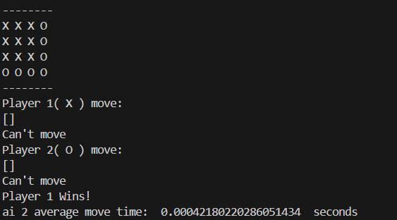
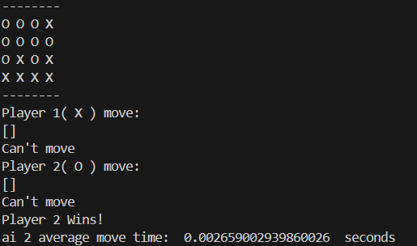
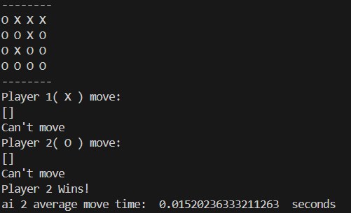
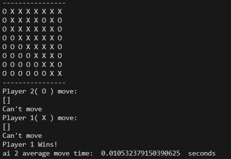
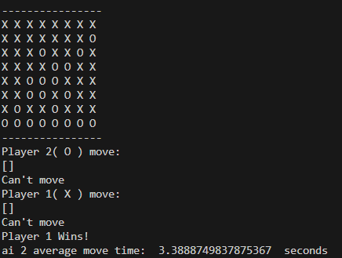

# othello-python
Starter Code for Othello AI Agent Programming Assignment

Originally created by Erich Kramer at OSU for Professor Rebecca Hutchinson.
Cleaned up by Rob Churchill.

How to play a game:

1. Run `python3 game_driver.py [player_type] [player_type]`.
2. Choose `human`, or `minimax` as the player types.
3. Follow the prompts to choose where to place stones.

Simulate four games between yourself and the minimax player on a 4x4 board, with the
depth parameter set to 5, 3, 2, and 1, respectively.
a. What were the results of each game?

Game Results:

# 4x4
 ## 1 depth
 

 ## 2 depth
 

 ## 3 depth
 

 ## 5 depth
  

 For the 4x4, the average time per move was very low(due to the small board size), but it did increase as the depth increased. This makes sense, as the search explores more potential moves the deeper the depth is. however, shallower depths lead to less optimal play, as depths such as 1 and 2 would only look ahead 1 or 2 moves, which is most likely less than a human looks forward.
 
# 8x8
 ## 2 depth
 

 ## 5 depth
 

For the 8x8, the average time per move was reasonable for a depth of 2, but a depth of 5 produced moves more in the 2 second range, which felt slow. Additionally, even at 5 depth, the ai was not able to beat me, which makes sense, as some intuitive Othello strategies are predictive enough that moderate depths cant beat them(such as corner/edge biased play). 

